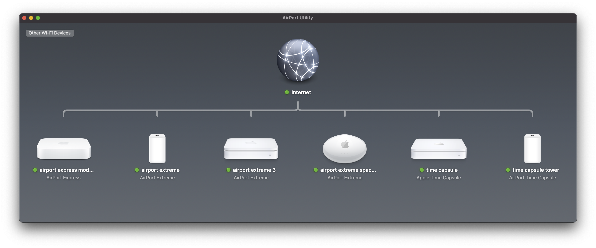
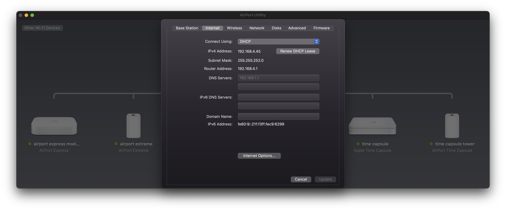

# AirPort Utility (beta)

Apple's AirPort Utility is not guaranteed to run on macOS 27 and newer, so I reverse engineered the application and have reimplemented it for macOS 27 and newer with Swift (front-end code) and Python (backend protocol code). I leveraged Codex to accelerate this work.

## Download

**[Download AirPort Utility 0.1.0](https://github.com/JYPochez/VNS-Airport-Utility/releases/tag/v0.1.0)**
— signed, notarized, and localized into English, French, German, Spanish and
Italian. Universal (Apple Silicon and Intel), macOS 13 or later.

Unzip and drag **AirPort Utility.app** to your Applications folder. Because the
build is notarized by Apple, it opens without a Gatekeeper warning.

Two things on first launch:

- **Approve the Local Network prompt.** Base stations are found over Bonjour and
  configured over ACP on port 5009, both of which count as local network access.
  Declining it means no devices are discovered.
- **Python 3 must be present.** The app drives a Python backend bundled inside
  it, run with the interpreter already on your Mac. The system `python3` works.

This is a fork of [jackhumphries/airport-utility](https://github.com/jackhumphries/airport-utility)
adding a double-clickable app bundle and localization. Not affiliated with Apple.

---





I have tested the app with the AirPort models below. However, bugs still remain and there are models I have not tested with. Even for devices that I have tested with, I cannot test all features, such as PPPoE, as I lack the necessary hardware. All contributions are welcome! Please open bug reports for any issues you find and pull requests are greatly appreciated!

---

### Compilation

The build and runtime requirements are:

- macOS 13 or newer
- Swift 6.0 or newer, provided by Xcode 16 or newer or the corresponding Command Line Tools
- Python 3.10 or newer available on `PATH` as `python3`

The project has no third-party Swift packages or Python packages to install.
AppKit, SwiftUI, Security, Bonjour, and CommonCrypto are provided by macOS.

On a new Mac, install the Command Line Tools:

```sh
xcode-select --install
```

If `python3 --version` reports a version older than 3.10, install a newer
Python. For example, with Homebrew:

```sh
brew install python
```

Verify that the required tools are selected:

```sh
swift --version
python3 --version
```

Then compile and run the application from the root of the repository:

```sh
./run.sh
```

---

### macOS application

`run.sh` builds and launches the app from the command line. To get a real,
double-clickable `AirPort Utility.app` — with an icon, an `Info.plist`, and the
Python backend embedded so it is self-contained — use either of the two build
paths below. Both produce an identical bundle.

**Shell script** (no Xcode project needed):

```sh
./make-app.sh                          # dist/AirPort Utility.app, unsigned
./make-app.sh --sign                   # + Developer ID signature
./make-app.sh --sign --notarize --zip  # + notarized, stapled, zipped
```

**Xcode**:

```sh
open AirPortUtility.xcodeproj          # scheme: "AirPort Utility App"
```

Set your team under Signing & Capabilities on first use. The project consumes
the package at the repository root as a local Swift package, so the source list
is never duplicated.

Both paths build a universal binary (`arm64` + `x86_64`) and lay the bundle out
like this:

```
AirPort Utility.app/Contents/
  Info.plist
  MacOS/AirPort Utility                        universal executable
  Resources/AppIcon.icns
  Resources/backend/                           embedded Python backend
  Resources/AirPortUtility_…Core.bundle        SwiftPM resources
```

#### Things worth knowing

- **Local Network permission.** On macOS 15 and newer a bundled app is its own
  privacy principal. `Info.plist` therefore declares
  `NSLocalNetworkUsageDescription` and `NSBonjourServices`; without them Bonjour
  discovery silently returns nothing and ACP connections to port 5009 fail.
  Running from Terminal hides this, because there the permission belongs to
  Terminal. macOS prompts once on first launch — approving it is required.
- **Python.** The backend is loaded from `Contents/Resources/backend`. A
  Finder-launched app inherits a minimal `PATH`, so `#!/usr/bin/env python3`
  would resolve to `/usr/bin/python3` — the Command Line Tools stub, Python
  3.9.6. The backend's full test suite passes there, but `Info.plist` sets
  `LSEnvironment/PATH` to prefer a Homebrew or python.org interpreter when one
  is installed.
- **Signing.** `codesign` treats everything in `Contents/MacOS` as code, so the
  backend must live in `Resources`. The bundle is signed with Hardened Runtime
  (required for notarization) and is **not** sandboxed, so the entitlements file
  is intentionally empty.

`Packaging/README.md` documents each load-bearing key and how to regenerate the
icon. Tagging `v*` runs `.github/workflows/release.yml`, which builds, signs,
notarizes, staples and attaches the zip to a GitHub release.

---

### Localization

The app ships English, French, German, Spanish and Italian. Tables live in
`Sources/AirPortUtilityCore/Resources/<lang>.lproj/Localizable.strings` and are
reached through `AirPortLocalization`.

Keys are the English source strings, so an untranslated string falls back to
readable English rather than a symbolic key, and English behaviour is
unchanged.

To check another language without changing your system settings:

```sh
swift run "AirPort Utility" -AppleLanguages '(fr)'
```

Three rules when adding strings:

- **Never localize protocol text.** ACP keys (`syNm`), backend flags
  (`--router-mode`), JSON keys, and any `Codable`-persisted raw value are wire
  format. `Pane.rawValue` stays English for that reason — it is persisted, used
  for snapshot file names, and used to build accessibility identifiers; the
  localized title is `Pane.displayName`.
- **Budget the length.** The window is a fixed 800×504, and German and French
  run 20–30% longer than English. `LocalizationTests` catches missing and
  untranslated keys, but not overflow — render the pane and look at it.
- **Language resolution goes through `Locale.preferredLanguages`,** not the
  one-argument `Bundle.preferredLocalizations(from:)`. That variant matches
  against the *main* bundle's localizations, which are empty in command-line
  and test builds, and would silently pin every lookup to English.

---

### Testing

Run the Swift unit tests from the root of the repository:

```sh
swift test
```

The default test run skips slower subprocess integration tests. Include them
with:

```sh
AIRPORT_UTILITY_SLOW_TESTS=1 swift test
```

Run the Python backend unit tests separately:

```sh
python3 -m unittest Tests/BackendPythonTests/test_backend_modules.py
```

Live base-station tests are skipped unless their `AIRPORT_LIVE_*` environment
flags are explicitly set. These tests can change network, password, disk, or
firmware settings on real hardware and are not required for the normal test
suite.

---

### Recovered AirPort models

The app has been tested with these AirPort models. The app is still likely to work with AirPort models not listed, at least partially. The goal is to fully support all features of all models.

Name | Model | ACP Version | Device-Specific Features
--- | --- | --- | ---
AirPort Express | A1088 | v1 | AirPlay
AirPort Express | A1392 | v2 | AirPlay
AirPort Extreme | A1034 | v1 | Modem, No NAS
AirPort Extreme | A1354 | v2 | NAS
AirPort Extreme | A1521 | v2 | NAS
Time Capsule | A1254 | v2 | NAS, Internal Disk
Time Capsule | A1470 | v2 | NAS, Internal Disk
